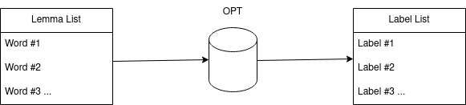
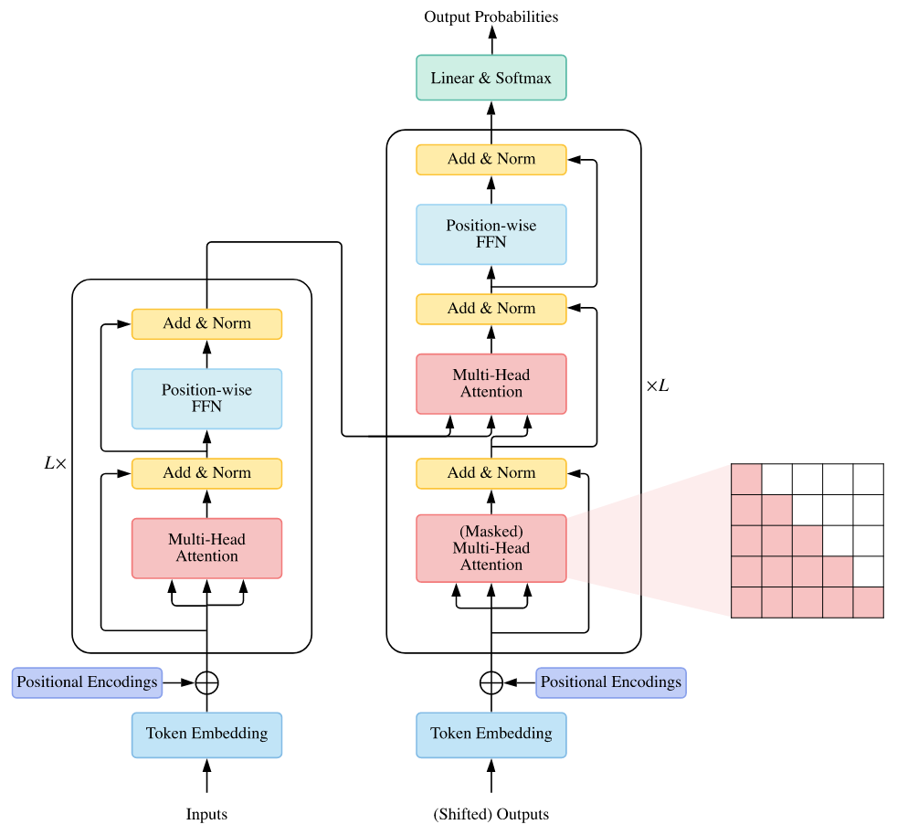
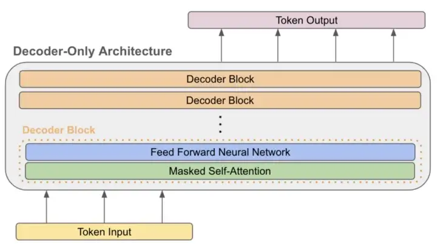

---
# try also 'default' to start simple
theme: academic
# random image from a curated Unsplash collection by Anthony
# like them? see https://unsplash.com/collections/94734566/slidev
layout: cover
coverBackgroundUrl: https://source.unsplash.com/collection/94734566/1920x1080 # TODO CAMBIARLA
coverAuthor: Federico Torrielli
coverDate: 14/04/2023
# apply any windi css classes to the current slide
class: 'text-center'
# https://sli.dev/custom/highlighters.html
highlighter: shiki
# show line numbers in code blocks
lineNumbers: false
# persist drawings in exports and build
drawings:
  persist: false
# page transition
transition: slide-left
# use UnoCSS
# css: unocss
# https://github.com/alexanderdavide/slidev-theme-academic
---

# How shall a machine call a thing?

Exploring Basicness in Language through Attention-based Neural Networks and Human-in-the-Loop Methodology

  
    
  

<!--
The last comment block of each slide will be treated as slide notes. It will be visible and editable in Presenter Mode along with the slide. [Read more in the docs](https://sli.dev/guide/syntax.html#notes)
-->

---
layout: center
---

# Introduzione

Il linguaggio è la **proprietà evolutiva** che primariamente ci differenzia da qualsiasi altro animale.

Solo grazie ad esso riusciamo a comunicare, costruire relazioni e creare comunità che ci hanno permesso di fare un considerevole salto evolutivo.

La stessa azione del comunicare è considerevole e sottovalutata: ci permette (non ironicamente!) di **leggere nelle menti** altrui.

---
layout: center
---

# Il vocabolario

Il vocabolario è il cuore pulsante della nostra lingua, **l'elemento comune** a qualsiasi dialetto.

Gli umani hanno un'ottima capacità di comunicare grazie a **set di lessemi** ed espressioni linguistiche che solitamente sono organizzate tramite **strutture gerarchiche**:

- Super-ordinate: categorie **inclusive**, generali, ampie
- Subordinate: categorie *specifiche* fatte di relazioni **iponimiche** con le precedenti

---
layout: center
---

# Basic/Advanced Level

Nel contesto sovracitato si colloca la nozione psico-linguistica del **basic level**, ciò che, secondo la letteratura, possiede le seguenti caratteristiche:
- Livello *ottimale* di **economia cognitiva**
- Alto livello di class-inclusion
- Mediamente generale, culturalmente comune e saliente

---
layout: center
---
# Contributi della tesi

Indentificazione di termini *basic* e *advanced* tramite due approcci computazionali:

- Approccio **testuale**: un large language model pre-addestrato e utilizzato generativamente
- Approccio **multi-modale**: una pipeline *text+image* che sfrutta reti neurali multi-modali stato dell'arte.

Inoltre, un'ulteriore contributo è la creazione di un dataset di 500 parole *basic* e *advanced* esemplari grazie ad un *panel* di **dieci annotatori** umani e la **definizione** della nozione di **basicness**, basandosi sulla letteratura esistente sulla *concreteness* e 

---
layout:center
---

# Nota: distacco dalla letteratura corrente

Il nostro approccio fa un passo indietro da quella che è considerata la letteratura *comune* riguardante il **basic level**, che solitamente è orientata al livello **concettuale**, per i seguenti motivi:

- Analizzare termini **e** concetti in maniera congiunta crea una evidente **complessità** di analisi che la corrente letteratura ignora
- Esperimenti pre-esistenti prendono in considerazione solo spazi semantici quali *cibo, strumenti musicali e attrezzi*
- Le categorie *basic* vegono analizzate senza una corretta e precisa definizione che invece risulta imperativa.

Per queste motivazioni, il nostro scopo è di analizzare **termini considerati basic da second-language learners**.
---
layout: center
---
# How shall a thing be called? (1958)

  

Roger Brown pone una *domanda* fondamentale: 

> Come facciamo a scegliere un **termine appropiato** per un **concetto** scelto?

---
layout: two-cols
---

# Il basic di Brown

Individua **4 caratteristiche fondamentali** che devono condividere le parole basic:

- Brevi
- Concrete
- Facili da pronunciare
- Frequentemente utilizzate tra le disponibili per un certo concetto

::right::

# Il nostro basic

<v-clicks>

- Strumenti per la **sopravvivenza sociale**
- Brevi, facili da pronunciare *verbalmente* e da concettualizzare
- Le **prime parole** che vengono alla mente quando si parla di un certo *topic*
- Facilmente traducibili in una **chiara immagine mentale**

</v-clicks>
---
layout: two-cols
---

# Basic

- House, Book, Chair, Table
- Orange, Apple
- Dog, Cat
- Thing, Fact
- Justice, Fun

::right::

# Advanced

- Mansion, Novel, Recliner, Board
- Tangerine, Granny Smith
- Chihuahua, Maine coon
- Artifact, Evidence
- Reprisal, Amusement

---

# Basic level e teoria duale

- Termini *basic* e *advanced* sono associati alla teoria duale di Daniel Kahneman (System 1/2):
  - **basic**: 
    - collegati al System1
    - facilmente accessibili alla memoria
    - richiedono sforzo minimo
    - preferiti per decisioni rapide
  - **advanced**: 
    - collegati al System2
    - richiedono uno sforzo maggiore
    - forniscono una descrizione dettagliata
    - appropiati per considerzioni e analisi accurate

---
layout: center 
transition: slide-up
---
# Utilizzo del basic level

- Utili per chi **impara una nuova lingua**: comprensione, produzione e conversazione
- Utilizzo nella **UI** di un prodotto
- Utilizzo in **automatic recommenders**, generatori di **sommari** ed **information extraction**

---
layout: cover
# TODO mettere immagine di background anche qua
---

# Task sul livello testuale

Il metodo OPT

---
layout: center
---

# Text-Based Pipeline

La prima pipeline utilizza *OPT*, un large language model generativo **transformer-based**.

  

---
layout: two-cols
---

# Transformers

Rete neurale basata su uno stack di **encoder-decoder**, adatta per dati di tipo testuale.

- **Encoder**: processa la sequenza di input (una serie di token) e restituisce un **embedding** (una rappresentazione continua) utilizzando la **self-attention** e un layer **feed-forward** in maniera indipendente.
- **Decoder**: prende gli embeddings in input e ha come output finale una distribuzione probabilistica sul singolo token.

  

::right::

  

---
layout: two-cols
---

# Encoder Side

   
  

::right::

# Decoder Side

   
  

---
layout: center
---

# Architettura OPT

Suite di decoder-only pre-trained transformers: architettura **auto-regressiva** semplice, composta solo da decoder impilati.

  

---

# I Transformer non sono altro che Next Token Predictor

- **Obiettivo**: prevedere il **token successivo** in una sequenza di parole, migliorando la coerenza e la comprensione del testo generato
- **Funzionamento**:
  - Viene utilizzata la *multi-headed attention* per catturare informazioni da contesti diversi
  - Calcola la **probabilità** di ciascun token candidato nel **vocabolario**
  - Seleziona il token con la **probabilità più alta** come previsione successiva

<v-clicks>

- Federico
- prenderà
- il
- seguente
- voto:

</v-clicks>